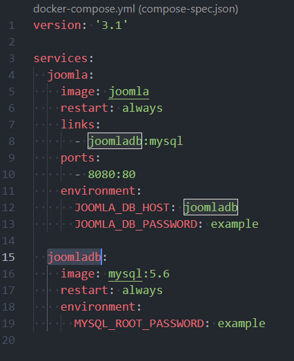
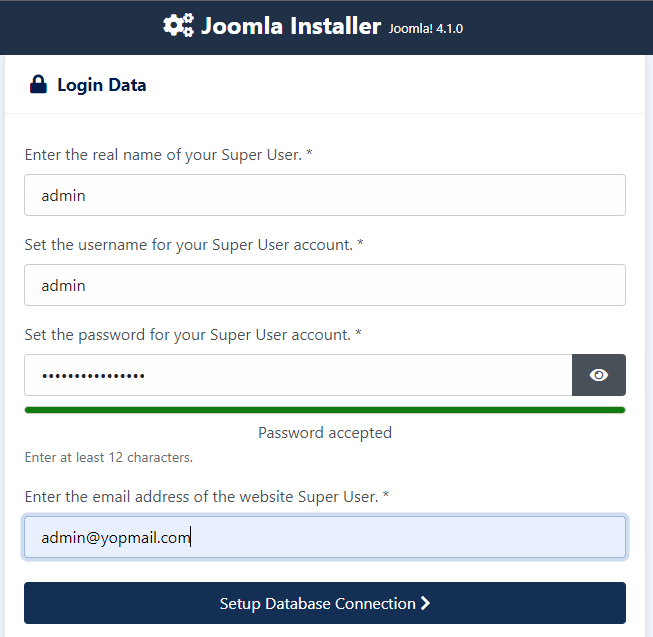
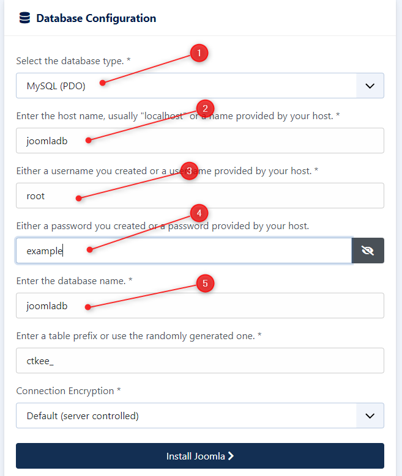

# jday_2022_docker

>Support pour la session Docker lors du JoomlaDay FR 2022 ([https://www.joomladay.fr/](https://www.joomladay.fr/))


Copie d'un message Skype que j'ai envoyé à Marc; nécessite d'être retravaillé.

## Saison 1 - Play and throw away

Le point de départ est [https://hub.docker.com/_/joomla](https://hub.docker.com/_/joomla).

Va sur la page [https://hub.docker.com/_/joomla](https://hub.docker.com/_/joomla) et cherche `... via docker stack deploy or docker-compose`

Tu vas trouver le contenu d'un fichier qu'il nomme `stack.yml`.

Crée un nouveau dossier sur ton disque dur, crée un fichier nommé `docker-compose.yml` et colle le contenu. Clique ici pour télécharger le fichier : [docker-compose.yml](./files/docker-compose.yml).

Tu auras donc un fichier avec ceci : 



En ligne de commandes (DOS donc), lance cette instruction depuis le dossier où tu as ton fichier `docker-compose.yml` :

```bash
docker compose up -d
```

Tu verras que Docker va télécharger Joomla et MySQL puis tout un blabla pour te dire ensuite que les deux `services` sont `Started`.

Et hop, direction ton browser : accède à l'URL [http://127.0.0.1:8080](http://127.0.0.1:8080) (pourquoi `8080`? Va voir le fichier `docker-compose.yml` en ligne 10).

Et bingo ! l'interface d'installation de Joomla 4.1.0.

Premier écran, que du très normal (=introduit ce que tu veux)



Deuxième écran : la DB. 



Ouvre le fichier `docker-compose.yml` sur un écran et regarde mon image sur un deuxième écran. Sur mon image : 

1. `MySQL` : parce que nous avons demandé MySQL comme service DB (on aurait pu choisir Postgres p.ex.). Dans le fichier `docker-compose.yml`, il faut regarder la ligne 16 (image MySQL),
2. `joomladb` comme host : regarde la ligne 15, c'est le nom de notre service pour la base de données,
3. `root` comme user : là, c'est juste parce que c'est la valeur par défaut (on aurait pu la changer). Vois l'URL [https://hub.docker.com/_/joomla](https://hub.docker.com/_/joomla) dans `How to use this image`; ils ont mentionné le nom à utiliser par défaut,
4. `example` comme mot de passe : regarde la ligne 19 du fichier `docker-compose.yml`,
5. `joomladb` pour la base de données : ligne 12 dans le fichier `docker-compose.yml`.

Le piège, c'est de mettre `localhost` comme nom de host; je me fais à chaque fois avoir.  C'est le nom du service (ligne 15).

Et si tu avais envie d'autres valeurs ? Feel free to update the `docker-compose.yml` file.

Pourquoi avons-nous installé J 4.1.0 ? Parce qu'on n'a rien demandé !

Vois le fichier `docker-compose.yml`, ligne 5. Tu trouveras la ligne `image: joomla` ==> nous n'avons pas donné de version et donc c'est `latest` par défaut.

Retour sur la page [https://hub.docker.com/_/joomla](https://hub.docker.com/_/joomla) et remonte en haut de page. Il y a les `supported tags`.

Prenons le dernier affiché `3.10.6-php7.4-fpm` et changeons `fpm` par `apache` (important)

==> édite ton fichier `docker-compose.yml` et adapte la ligne 5 vers ceci : `image: joomla:3.10.6-php7.4-apache`

Sauve et ferme le fichier.

Sous DOS, lance `docker compose down` (pour stopper et tuer les services Joomla et MySQL)

Tu verras `... Removed` pour Joomla et Joomladb

Si tu retournes sur l'URL [http://127.0.0.1:8080/](http://127.0.0.1:8080/) tu verras que le site est mort.

Puisqu'on a changé le fichier `docker-compose.yml` pour demander Joomla 3.10.6, hop, on relace `docker compose up -d` en ligne de commandes.

Tu verras que Docker va télécharger à nouveau (J3.10.6) mais qu'il ne va pas retélécharger MySQL puisqu'il l'a déjà.

Et hop, [http://127.0.0.1:8080/](http://127.0.0.1:8080/) et cette fois c'est l'installateur J3.x qui est là.

Et tu viens d'apprendre comment changer de versions de Joomla à la volée.

Tiens, et maintenant ? va un peu voir sur ton disque dur dans le dossier où tu as créé le fichier `docker-compose.yml`.

Fais un `dir` pour afficher la liste des fichiers. Que vois-tu et pourquoi ? 

## Saison 2 - Be proud and keep your work

Expliquer la gestion des volumes pour garder la trace des fichiers Joomla et de la base de données.
