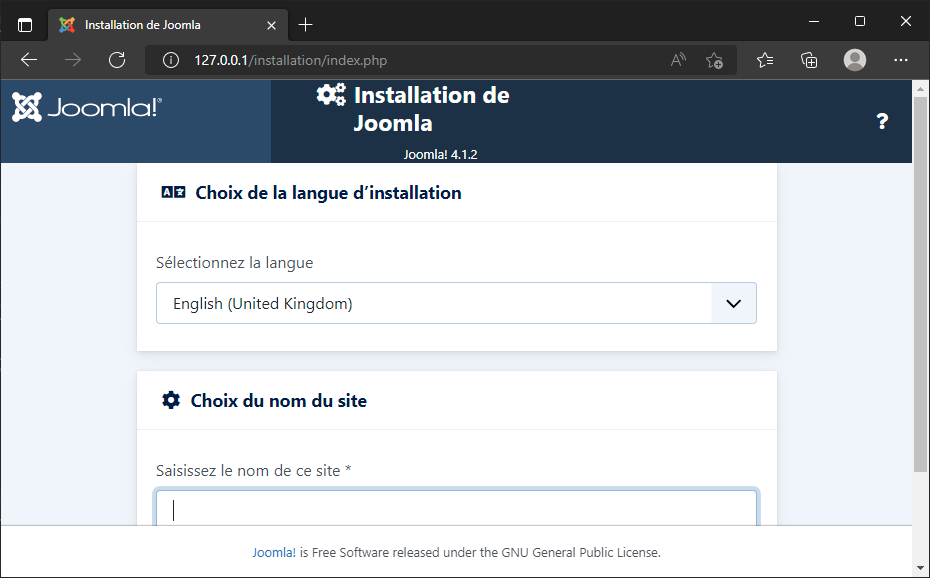

# Installer Joomla facilement avec Docker

<!-- .slide: data-background="./images/background.jpg" data-background-size="cover" -->

## Étape 0 - Installation de Docker

<!-- .slide: data-background="./step_0_installation_docker/images/background.png" data-background-size="cover" -->

L'installation de Docker est gratuite pour un usage personnel ou dans le cadre d'une petite structure : [https://www.docker.com/products/personal/](https://www.docker.com/products/docker-desktop/). 

Vous pouvez l'installer sur Linux, Mac ou Windows.

La façon la plus simple est d'utiliser [Docker Dekstop](https://www.docker.com/products/docker-desktop/).

## Étape 1 - Au Début était Docker ...

Prenons le temps de découvrir Docker... Grâce à lui, il n'est plus nécessaire d'installer PHP ou Apache pour faire tourner un site web.

On retrouve sur [Docker Hub](https://hub.docker.com) un très grand nombre "d'images" qui permettent d'exécuter des logiciels comme PHP, PHP+Apache, MySQL et bien, bien d'autres choses. 

----

Toutes ces images sont totalement gratuites; elles peuvent être publiques ou privées. On peut créer ses propres images et les stocker sur [Docker Hub](https://hub.docker.com) gratuitement. 

Nous allons utiliser les images PHP disponibles sur [https://hub.docker.com/_/php](https://hub.docker.com/_/php)

----

Durant cette première étape, de découverte, nous allons exécuter un simple script PHP afin de montrer comment ... ne pas installer PHP et Apache. 

Nous changerons ensuite la version de PHP de `7.4` vers `8.1` en juste quelques ... touches enfoncées au clavier.

----

<!-- .slide: data-background="./step_1_php/images/background.png" data-background-size="cover" -->

Nous aurons besoin d'une image Docker qui inclut PHP et Apache pour faire tourner notre script. Par chance, une telle image existe :-)

Nous utiliserons les instructions `docker run`.

----

<!-- .slide: data-background="./step_1_php/images/attention.jpg" data-background-size="cover" -->

Durant ce chapitre, lors de notre découverte de Docker, nous utiliserons des numéros de port à chaque fois différents pour accéder à notre site local. Nous verrons plus tard comment réutiliser le même numéro de port.

### Étape 1.1 - Exécution d'un script php

> Les commandes que nous utiliserons lors cette étape seront les mêmes que vous soyez sous Linux, Mac ou Windows.

En exécutant l'instruction ci-dessous nous allons télécharger PHP `7.4.29` ainsi qu'Apache et démarrer l'image:

```bash
docker run --detach --name step_1_1a -p 80:80 php:7.4.29-apache
```

*Tip: Lors des exécutions ultérieures, l'image PHP étant déjà présente, elle n'est plus téléchargée.*

----

<!-- .slide: data-background="./step_1_php/1_minimum/images/desktop_image_step_1_1.png" data-background-size="cover" class="hide_title" -->

----

Nous pouvons constater que l'image PHP est maintenant présente dans Docker Desktop.

On obtient aussi l'information en ligne de commande : `docker image list`

----

<!-- .slide: data-background="./step_1_php/1_minimum/images/desktop_container_step_1_1a.png" data-background-size="cover" -->

Nous voyons aussi qu'une application (un `container` en terme Docker) est également en cours d'exécution.

En ligne de commande : `docker container list`

----

Explication des arguments utilisés dans notre commande `docker run --detach --name step_1_1a -p 80:80 php:7.4.29-apache`

* `--detach` : par défaut, `docker run` exécute le container et le ferme aussitôt le travail terminé. Si l'image était un scanner de virus, `docker run` exécuterait un scan et ferme le container le scan terminé. Ici, nous voulons que notre site reste "à l'écoute",
* `--name step_1_1a` : juste par simplicité, donnons un nom à notre container. C'est une pratique recommandée pour identifier clairement les containers,
* `-p 80:80` : notre image PHP+Apache s'exécute sur le port `80`, nous souhaitons "mapper" ce port "interne" au port `80` de notre ordinateur. Ceci nous permet alors d'accéder au site web.

----

<!-- .slide: data-background="./step_1_php/1_minimum/images/localhost_step_1_1a_0.png" data-background-size="cover" -->

Tentons d'accéder au site local : [http://127.0.0.1:80](http://127.0.0.1:80).

Il fonctionne mais n'affiche rien puisque nous n'avons encore rien mis en place.

*Le site est fonctionnel, Apache est prêt mais il n'y a pas de fichier index.php; ajoutons-en un.*

----

Avec l'instruction ci-dessous, on peut lancer une console Linux et afficher le contenu de l'image "comme si" c'était un dossier sur notre disque dur :

```bash
docker exec -it step_1_1a /bin/bash
```

Une fois dans la console, créons rapidement un fichier `index.php` et quittons la console; nous n'en aurons plus besoin.

```bash
echo "<?php" > index.php
echo "phpinfo();" >> index.php
exit
```

----

<!-- .slide: data-background="./step_1_php/1_minimum/images/localhost_step_1_1a_1.png" data-background-size="cover" -->

Retournons dans notre navigateur et ... Bingo ! Notre première instance Docker exécutant un script PHP !

----

Reprenons l'instruction que nous avions utilisée :

```bash
docker run --detach --name step_1_1a -p 80:80 php:7.4.29-apache
```

On voit donc qu'on cible la version `7.4.29` de PHP. En se rendant sur la page
[https://hub.docker.com/_/php?tab=tags](https://hub.docker.com/_/php?tab=tags) et en cherchant des images de type `-apache`, on retrouve p. ex. les versions `php:8.1.1-apache` ou encore `php:8.1.5-apache`.

----

Changeons `7.4.29` par `8.1.5` et pour l'exemple, utilisons un autre port (nous utiliserons le port `801` cette fois).

```bash
docker run --detach --name step_1_1b -p 801:80 php:8.1.5-apache
```

```bash
docker exec -it step_1_1b /bin/bash
```

```bash
echo "<?php" > index.php
echo "phpinfo();" >> index.php
exit
```

----

<!-- .slide: data-background="./step_1_php/1_minimum/images/localhost_step_1_2.png" data-background-size="cover" -->

Sans aucune prise de tête et zéro conflit !!! Nous avons installé une nouvelle version de PHP.

----

<!-- .slide: data-background="./step_1_php/1_minimum/images/we-have-learned.jpg" data-background-size="cover" -->

À la fin de ce chapitre, nous venons d'apprendre:

* à utiliser Docker,
* à définir la version de PHP que nous souhaitons utiliser,
* à nommer nos containers,
* à définir des ports différents selon nos containers.

Passons maintenant à la vitesse supérieure et synchronisons les fichiers de notre disque dur avec le container.

### Étape 1.2 - Utilisation d'un volume

> Soyez certain d'être dans le sous-dossier step_1_php/2_volume pour exécuter les exemples fournis.

Afin de synchroniser un fichier de notre disque dur avec le container, utilisons un volume:

```bash
docker run --detach --name step_1_2 -p 81:80 -v $(pwd):/var/www/html php:8.1.5-apache
```

Si vous êtes sous Windows (MS DOS), remplacez `$(pwd)` par `%CD%` dans l'instruction ci-dessus.

----

Rendez-nous à l'URL [http://127.0.0.1:81](http://127.0.0.1:81).

Notre script s'exécute immédiatement. Nous ne devons plus lancer une console et créer à la main le fichier `index.php`.


----

Explication des nouveaux arguments utilisés dans notre commande `docker run --detach --name step_1_2 -p 81:80 -v $(pwd):/var/www/html php:8.1.5-apache`

* `--name step_1_2` : par clarté, nous utilisons un autre nom,
* `-p 81:80` : cette fois, nous allons utiliser le port `81` de notre ordinateur et nous allons le mapper au port `80` du container,
* `-v $(pwd):/var/www/html` : l'instruction `-v` permet de définir un volume. Ici, nous allons synchroniser le dossier `/var/www/html` du container avec `$(pwd)` qui correspond au dossier courant de notre ordinateur.

----

Éditons le fichier `index.php` et changeons p. ex. `Bruxelles` en `la Belgique`.

Retournons dans notre navigateur et appuyons sur la touche <kbd>F5</kbd>. Le changement est immédiat.


----

<!-- .slide: data-background="./step_1_php/2_volume/images/we-have-learned.jpg" data-background-size="cover" -->

À la fin de ce chapitre, nous avons appris, en plus:

* à synchroniser un dossier (et ses sous-dossiers) de notre ordinateur avec le container.

Dans la troisième étape de ce chapitre, nous allons garantir que les fichiers qui seraient créés depuis Docker le soient avec les bonnes permissions (`user:group` et `chmod`).

### Étape 1.3 - Gestion des permissions - Linux

> Ce chapitre ne s'applique pas aux utilisateurs qui travaillent sous Windows (mais bien si vous travaillez sous WSL).

> Soyez certain d'être dans le sous-dossier step_1_php/3_permissions.

----

Les fichiers qui sont créés depuis Docker sont des fichiers créés par le système d'exploitation Linux (**même si vous êtes sous Windows sur votre machine host**).

Contrairement à Windows, le système des permissions Linux est plus strict avec une notion de groupe-utilisateur-reste_du_monde (le fameux `chmod`).

Imaginons que le script PHP qui s'exécute dans Docker serait le suivant, c.-à-d. créer un fichier dans le dossier courant :

```php
$filename=__DIR__."/maintenant.txt";
if (file_put_contents($filename, "Nous sommes le $date" . PHP_EOL) !== false) {
    echo "Le fichier $filename a été créé";
} else {
    echo "Erreur, impossible de créer le fichier $filename";
}
```

----

Exécutons un nouveau container avec l'instruction ci-dessous : 

```bash
docker run --detach --name step_1_3_1 -p 82:80 -v $(pwd):/var/www/html php:7.4.29-apache
```

Accédons maintenant à l'URL [http://127.0.0.1:82/](http://127.0.0.1:82/). Nous verrons que nous avons une erreur.

----

<!-- .slide: data-background="./step_1_php/3_permissions/images/localhost_step_1_3_0.png" data-background-size="cover" class="hide_title" -->

----

Docker (utilisateur `root:root`) n'a donc pas réussi à créer un fichier sur notre disque dur; il faut donc lui indiquer qu'il faut utiliser notre utilisateur local.

----

Modifions notre instruction et analysons les changements : 

```bash
docker run --detach --name step_1_3_2 -p 83:80 -u $UID:$GID -v $(pwd):/var/www/html php:7.4.29-apache
```

* `--name step_1_3` : comme d'habitude, utilisons un nom précis,
* `-p 83:80` : cette fois-ci, ce sera le port `83`,
* `-u $UID:$GID` : ce paramètre est le plus important ici, on indique à Docker qu'on veut que les fichiers / dossiers qui seraient créés depuis le container n'utilisent par `root:root` mais notre utilisateur actif ainsi que son groupe d'appartenance (p. ex. `christophe:christophe`)

----

<!-- .slide: data-background="./step_1_php/3_permissions/images/localhost_step_1_3_1.png" data-background-size="cover" -->

Cette fois-ci, avec l'URL [http://127.0.0.1:82/](http://127.0.0.1:82/), notre fichier est créé sans souci.

----

On peut voir le fichier `maintenant.txt` dans notre dossier.

Si on tape l'instruction `ls -l` dans notre console Linux, on constate qu'en effet le fichier `maintenant.txt`, qui a été créé par Docker, utilise bien notre utilisateur local; exactement ce qu'on souhaitait.

```text
drwxr-xr-x 2 christophe christophe 4096 May  7 22:06 images
-rw-r--r-- 1 christophe christophe 1112 May  7 21:53 index.php
-rw-r--r-- 1 christophe christophe   33 May  7 22:05 maintenant.txt
-rw-r--r-- 1 christophe christophe 1843 May  7 22:05 readme.md
```

----

<!-- .slide: data-background="./step_1_php/3_permissions/images/we-have-learned.jpg" data-background-size="cover" -->

À la fin de ce chapitre, nous avons appris, en plus:

* à spécifier les permissions sur Docker doit utiliser lors de l'accès au système de fichiers.

Une dernière astuce pour la route : l'utilisation d'images Alpine. Suite à la prochaine étape.

### Étape 1.4 - Extra - Recherche d'une image de type Alpine

> Sous Linux, une image Alphine est synonyme d'ultra-légère. Le maximum a été retiré et juste l'essentiel est conservé.

Nous avons jusqu'à présent utilisé une image officielle maintenue par la communauté Docker [https://hub.docker.com/_/php](https://hub.docker.com/_/php). Ces images sont sécurisées car validées par la communauté.

```bash
docker run --detach --name step_1_2 -p 81:80 -v $(pwd):/var/www/html php:8.1.5-apache
```

----

Il n'existe pas toujours une image alpine officielle (ce n'est pas le cas pour une image PHP incluant Apache).

Si on cherche sur [Docker Hub](https://hub.docker.com/), il est toutefois possible d'en trouver comme [eriksoderblom/alpine-apache-php](https://hub.docker.com/r/eriksoderblom/alpine-apache-php) qui propose PHP 8 + Apache en mode hyper léger. 

----

Là où l'image officielle fait 458MB, l'image alpine n'est fait plus de 62. Près de 7,5 fois moins !


----

L'intérêt de ce type d'images est donc de réduire l'occupation mémoire de votre ordinateur et de vous permettre de lancer plusieurs images sans trop de ralentissement. 

Cela ne fonctionne que si et seulement si vos besoins sont hyper simples. Vous souhaitez p. ex. installer quelque chose avec `apt-get install` ? Impossible car le gestionnaire de paquets `apt` n'est pas installé. Vous avez vraiment le strict minimum et vous aurez à tout installer vous-même selon vos besoins.

----

<!-- .slide: data-background="./step_1_php/4_alpine/images/we-have-learned.jpg" data-background-size="cover" -->

Un dernier extra pour la route, utilisation d'un script Bash. Rendez-vous à la prochaine, et dernière, étape.

### Étape 1.5 - Extra - Utilisation d'un script Linux

> Ce chapitre, optionnel, propose un script Bash qui nécessite Linux pour s'exécuter. Si vous êtes sous Windows (MS DOS), vous ne pourrez pas l'utiliser. Mais bien si vous êtes sous WSL.

Au tout début du chapitre, nous avons vu la commande suivante :

```bash
docker run --detach --name step_1_1a -p 80:80 php:7.4.29-apache
```

Imaginons que nous souhaitons relancer la même commande, une seconde fois :

```text
docker: Error response from daemon: Conflict. The container name "/step_1_1a" is already in use by container "dbb03c847cf13f691f75207cb61f813d34a83b1f230bc0b3a15e93361d6ff484". You have to remove (or rename) that container to be able to reuse that name.
```

----

Docker nous dit que nous avons déjà un container nommé `step_1_1` précédemment créé. Si nous changeons le nom en, p. ex. `step_1_1_bis`, nous aurons un autre souci :

```text
docker: Error response from daemon: driver failed programming external connectivity on endpoint step_1_1_bis (31dfed5214c2ebea24e059f7d4ca65c717bd0373b88d2adc4d02b67923c481ed): Bind for 0.0.0.0:80 failed: port is already allocated.
```

En effet, nous disons que `step_1_1_bis` doit utiliser le port `80` mais ce dernier est déjà utilisé (par le container `step_1_1a`), il nous faudrait alors aussi changer le numéro du port (comme nous l'avons fait à chacune des étapes précédentes).

----

En ligne de commandes, pour stopper un container:

```bash
docker stop $(docker ps -a -q --filter="name=step_1_1a")
```

Puis, pour le supprimer:

```bash
 docker rm $(docker ps -a -q --filter="name=step_1_1a")
```

Un peu long...

----

<!-- .slide: data-background="./step_1_php/5_script/images/docker_desktop.png" data-background-size="cover" -->

Plus facile avec Docker Dekstop, on supprime le container.

----

Le script `docker-up.sh` proposé dans ce chapitre permet de vérifier si le container est déjà en cours d'exécution. Si c'est le cas, il sera d'abord arrêté proprement puis supprimé. Et seulement ensuite récréé.

Le script permet donc de simplifier l'exécution des commandes `docker run` comme vues lors des précédents chapitres de cette première étape de découverte de Docker.

----

<!-- .slide: data-background="./step_1_php/5_script/images/we-have-learned.jpg" data-background-size="cover" -->

À la fin de cette dernière étape du premier chapitre de découverte, nous avons appris, en plus, à utiliser un script qui va arrêter, supprimer et relancer un container. Facile et propre.

Le script permet aussi de spécifier certaines variables comme p. ex. la version de PHP à utiliser.

## Étape 2 - ... Joomla vint ensuite

<!-- .slide: data-background="./step_2_install_joomla/images/background.jpg" data-background-size="cover" -->

### Étape 2.1 - Installons Joomla

> Soyez certain d'être dans le sous-dossier step_2_install_joomla/1_installation pour exécuter les exemples fournis.

Lors de la première étape, nous n'avions pas besoin d'une base de données, juste de PHP et d'Apache. Et comme il existe une image Docker qui reprend et PHP et Apache, c'était facile. Un coup de `docker run` et tout roule.

Lorsqu'on a besoin de plusieurs *services*, une commande `docker run` ne suffit plus. Il faut alors utiliser `docker compose`.

----

Lorsqu'on a besoin de plusieurs services, il faut un fichier `docker-compose.yml` à la racine du projet. On y définit la liste des services dont on a besoin.

Vous trouverez un exemple du fichier `docker-compose.yml` sur la page de description de l'image Joomla : [https://hub.docker.com/_/joomla](https://hub.docker.com/_/joomla) *recherchez `docker-compose` sur cette page.*

----

```yaml
version: '3.1'

services:
  joomladb:
    image: mysql:5.6
    restart: always
    environment:
      MYSQL_ROOT_PASSWORD: example

  joomla:
    image: joomla
    restart: always
    links:
      - joomladb:mysql
    ports:
      - 80:80
    environment:
      JOOMLA_DB_HOST: joomladb
      JOOMLA_DB_PASSWORD: example
```

----

Créons ce fichier dans un dossier de votre disque dur.

Ouvrez une console et rendez-vous dans ce dossier.

Ceci fait, lancez la commande `docker compose up --detach`.

Docker va commencer à télécharger `joomla` et `joomladb`, les deux services mentionnés dans le fichier `docker-compose.yml`.

----

<!-- .slide: data-background="./step_2_install_joomla/1_installation/images/desktop_image_step_2.png" data-background-size="cover" class="hide_title" -->

----

Si on regarde la liste des images disponibles dans Docker Desktop, nous voyons que nous avons maintenant, `joomla` et `mysql`.

On obtient aussi l'information en ligne de commande : `docker image list`

----

<!-- .slide: data-background="./step_2_install_joomla/1_installation/images/desktop_container_step_2.png" data-background-size="cover" class="hide_title" -->

----

On retrouve aussi notre application qui, cette fois, contient deux containers en cours d'exécution.

En ligne de commande : `docker container list`

----

Notre application étant en cours d'exécution, on peut y accéder depuis l'URL http://127.0.0.1:80.



----

Reprenons le fichier `docker-compose.yml` mais partie par partie:

```yaml
services:
  joomladb:
    image: mysql:5.6
    restart: always
    environment:
      MYSQL_ROOT_PASSWORD: example
```

On va définir une couche base de données qui va faire tourner MySQL en version `5.6`. Le mot de passe associé au compte `root` sera `example`.

----

```yaml
services:
  joomla:
    image: joomla
    restart: always
    links:
      - joomladb:mysql
    ports:
      - 80:80
    environment:
      JOOMLA_DB_HOST: joomladb
      JOOMLA_DB_PASSWORD: example
```

On définit ici la couche application (Joomla) sans préciser de version. Ce sera donc la dernière version `stable` de ce moment-là. On dit à Joomla que le serveur de base de données associé sera `joomladb` qu'on a définit plus haut, on indique que le port sera le port `80` et on définit aussi deux variables d'environnement pour préciser que le nom de la base de données sera `joomladb` et que le mot de passe associé est `example`.

----

<!-- .slide: data-background="./step_2_install_joomla/1_installation/images/danger.jpg" data-background-size="cover" -->

Ce n'est pas une bonne idée de ne pas indiquer le numéro de version.

Lorsque Docker voit `image: joomla`, il comprend `image: joomla:stable`. Il va donc chercher à télécharger la dernière version stable. Vous ne savez donc pas, à l'avance, si vous téléchargez Joomla `4.1.2` ou `4.1.3` ou ...

Il est toujours préférable de spécifier la version comme p. ex.  `image: joomla:4.1.2`. Vous vous éviterez des surprises.

Voir [https://hub.docker.com/_/joomla?tab=tags](https://hub.docker.com/_/joomla?tab=tags) pour la liste des versions disponibles.

----

Les valeurs se retrouvent dans le fichier `docker-compose.yml`.

| Variable             | Valeur                                                             |
| -------------------- | ------------------------------------------------------------------ |
| Nom de l'hôte        | `joomladb` qui est le nom qu'on a donné au service base de données |
| Nom de l'utilisateur | `root` (utilisateur par défaut pour MySQL)                         |
| Mot de passe         | `example`                                                          |

----


----


----

<!-- .slide: data-background="./step_2_install_joomla/1_installation/images/surprised.jpg" data-background-size="cover" -->

Nous venons d'installer Joomla et MySQL. Si on exécute `ls -l` (ou `dir` sous DOS), on constate quelque chose qui pourrait être surprenant : nous n'avons aucun des fichiers de Joomla sur notre machine; rien du tout.

Comme nous l'avons vu lors de l'étape 1 d'introduction; tout se passe au sein du container. Comme si c'était une boîte noire. Les fichiers ont été installés dans le container, pas sur notre ordinateur.

Si on supprime le container Docker, nous perdons l'intégralité du site; base de données y comprise.

----

Envie d'utiliser une autre version de PHP ? Rendez-vous sur la page des tags [https://hub.docker.com/_/joomla?tab=tags](https://hub.docker.com/_/joomla?tab=tags) et prêtez attention aux images de type `xxx-apache` (p. ex. `php8.1-apache`).

Adaptez alors le fichier `docker-compose.yml` comme ci-dessous.

```yaml
services:
  joomla:
    image: joomla:php8.1-apache
```

Et hop, vous voilà avec la version de PHP désirée.

----

<!-- .slide: data-background="./step_2_install_joomla/1_installation/images/we-have-learned.jpg" data-background-size="cover" -->

À la fin de cette étape, 

* à créer un fichier `docker-compose.yml` afin de créer et associer plusieurs containers pour une application précise,
* à installer la version que nous souhaitons de Joomla ainsi que celle de PHP,
* à installer un second service qui, ici, est MySQL,
* et à associer Joomla et MySQL

Toutefois notre site est éphémère. Apprenons à conserver nos fichiers et notre base de données. Mais avant, lançons une petite session interactive dans Docker.

### Étape 2.2 - Session interactive

Si on lance `Docker Desktop` et qu'on se rend dans la liste des containers puis qu'on déplie le container en cours, on peut voir que le nom du service Apache est `1_installation-joomla-1` (c'est-à-dire le nom du dossier en cours suivi du nom du service puis du chiffre `1`).

On retrouve aussi le nom avec la ligne de commande `docker container list`.

Du coup `docker exec -it 1_installation-joomla-1 /bin/bash` permets de lancer une console dans le container et de se promener dans l'arborescence de l'installation Joomla.

----

Si on fait un `cat configuration.php`, on peut donc voir le fichier de configuration du site. Puisqu'il n'y a pas d'éditeur de texte dans l'image Joomla, utilisons `sed` pour remplacer la valeur offline de `false` vers `true` :

```bash
sed -i 's/public $offline = false/public $offline = true/g' configuration.php
```

Si on rafraîchit le navigateur, on voit bien qu'on a mis le site hors ligne. Ce qu'on voit dans la session interactive correspond bien à ce qu'on a sur la page du navigateur; nous sommes bien occupés à modifier le site Joomla.

*Tapons la commande `exit` pour quitter la session interactive.*

----

<!-- .slide: data-background="./step_2_install_joomla/2_session_interactive/images/we-have-learned.jpg" data-background-size="cover" -->

À la fin de ce chapitre d'installation de Joomla, nous avons appris, en plus :

* à adapter un fichier de Joomla en démarrant le container de façon interactive.

Lors du troisième chapitre, nous verrons comment synchroniser les fichiers entre le container et notre disque dur.

## Étape 3 - Synchronisons Joomla avec notre ordinateur local

<!-- .slide: data-background="./step_3_install_joomla_volume/images/background.jpg" data-background-size="cover" -->

----

> Soyez certain d'être dans le sous-dossier step_3_install_joomla_volume pour exécuter les exemples fournis.

Nous venons d'installer Joomla, on a pu installer l'une ou l'autre version de Joomla mais on constate que nous n'avons rien en local : si on supprime le container, on perd tout.

----

<!-- .slide: data-background="./step_3_install_joomla_volume/images/kill_container.png" data-background-size="cover" -->

Retournons dans Docker Desktop et supprimons le container. Affichons à nouveau le site `http://127.0.0.1:80/`, nous avons tout perdu !

----

Bien sûr, on peut installer une extension de sauvegarde comme Akeeba et s'amuser à prendre un backup; comme on le fait traditionnellement.

On peut aussi veiller à synchroniser notre container (la partie Joomla ainsi que la partie base de données) avec notre disque dur. Cette synchronisation fait appel à ce qu'on nomme dans le monde Docker : **un volume**.

----

Un volume peut être "interne" ou "externe". Interne veut dire que c'est Docker qui va le gérer.

On pourra supprimer le container Joomla mais tant qu'on ne supprime pas le volume interne, il reste en mémoire et Docker peut le réutiliser.

Si on supprime et le container et le volume alors on perd tout.

----

On va donc utiliser un volume externe.

On va *mapper* le site Joomla à notre disque dur. Quand nous avions lancé une session interactive (grâce à `docker exec -it 1_installation-joomla-1 /bin/bash`), nous avions constaté que le dossier du site était `/var/www/html`. Ce dossier est le `WORKDIR` (répertoire de travail) de l'image Joomla. On peut retrouver cette information dans la documentation de l'image, après avoir lancé une session interactive ou encore lorsqu'on fait un `docker inspect joomla | grep --ignore-case "workingdir"`.

----

Il faut adapter le fichier `docker-compose.yml` et, pour le service Joomla, d'ajouter la gestion des *volumes*. Nous allons faire correspondre le dossier `site_joomla` de notre ordinateur avec le site Joomla.

**D'abord, pour éviter tout problème de droits d'accès, veuillez créer le dossier `site_joomla` vous-même.**

```bash
mkdir -p site_joomla
```

Adaptons le fichier `docker-compose.yml` et ajoutons:

```yaml
    volumes:
      - ./site_joomla:/var/www/html
```

----

La lecture est peut-être plus aisée de droite à gauche : on va faire correspondre le dossier `/var/www/html` qui se trouve dans le container Docker avec le dossier `site_joomla` se trouvant dans notre répertoire actuel; sur notre machine (=sur notre host).

----

Retournons dans Docker Desktop et supprimons notre container Joomla en cours d'exécution.

Puis relançons la commande `docker compose up --detach`; on pourra constater qu'on aura bien, lors de la création de l'image, les fichiers de Joomla qui seront synchronisés avec notre disque dur.

Allez voir le contenu du dossier `site_joomla` sur votre ordinateur : nous avons l'intégralité des fichiers du site; nous avons donc synchronisé le container et notre machine.

### Étape 3.1 - Droits d'accès sous Linux

Tout comme nous l'avons vu précédemment, les fichiers / dossiers créés depuis Docker ne le sont pas avec notre utilisateur actif mais celui défini dans l'image. Pour PHP, nous l'avons vu, c'était l'utilisateur `root`.

Pour Joomla, c'est `www-data` et on le voit lorsqu'on fait un `ls -al`. Il nous faut, ici aussi, changer cela pour utiliser notre utilisateur local.

Tout d'abord, supprimons le précédent dossier `site_joomla` puis recréons-le (afin d'avoir les bonnes permissions):

```bash
sudo rm -rf site_joomla
mkdir -p site_joomla
```

----

Adaptons le fichier `docker-compose.yml` et pour y ajouter la notion de l'utilisateur, mais pour cela il nous faudra deux valeurs, le `user id` et le `group id`.

Sous Linux, on peut retrouver l'ID de son utilisateur et de son groupe comme ceci:

```bash
echo "Votre UID est $UID et votre GID est $GID"
```

Nous avons nos valeurs. Adaptons le fichier:

```yaml
    user: "1000:1000"
```

----

Retournons dans Docker Desktop et supprimons notre container Joomla en cours d'exécution.

Relançons `docker compose up --detach` et, maintenant, les fichiers dans le dossier `site_joomla` ont les bonnes permissions; celles de votre utilisateur local.

### Étape 3.2 - Ajout d'une image

Pour l'exemple, si on se rend dans le gestionnaire des médias de Joomla et qu'on ajoute une image, nous verrons bien cette image apparaître sur notre machine dans le dossier `./site_web/media`.

Notre synchronisation fonctionne parfaitement (et dans les deux sens bien sûr).

### Étape 3.3 - Installation d'Akeeba backup et sauvegarde

L'installation d'une extension ainsi que son utilisation n'est en rien différente. 

Depuis l'interface d'administration de Joomla, on peut installer Akeeba *depuis le web* et exécuter ensuite une sauvegarde. 

Si on utilise le profil par défaut, le `jpa` est sauvé, sur notre machine, dans le dossier `./site_joomla/administrator/com_akeebabackup/backup`; rien ne change.


### Étape 3.4 - Notre service Joomla final

Notre service `joomla` au complet dans le fichier `docker-compose.yml`.

```yaml
  joomla:
    image: joomla
    restart: always
    links:
      - joomladb:mysql
    ports:
      - 80:80
    environment:
      JOOMLA_DB_HOST: joomladb
      JOOMLA_DB_PASSWORD: example
    volumes:
      - ./site_joomla:/var/www/html
    user: "1000:1000"
```

----

<!-- .slide: data-background="./step_3_install_joomla_volume/images/we-have-learned.jpg" data-background-size="cover" -->

À la fin de ce chapitre, nous avons appris :

* synchroniser les fichiers de Joomla avec notre disque dur.

Si nous supprimons le container Joomla, nous n'allons plus perdre les fichiers de notre site web. Mais nous perdrons bien la base de données puisqu'elle n'est pas encore synchronisée localement. C'est ce que nous allons apprendre dans le prochain et dernier chapitre.

## Étape 4 - Synchronisons MySQL avec notre ordinateur local

<!-- .slide: data-background="./step_4_install_mysql_volume/images/background.jpg" data-background-size="cover" -->

----

> Soyez certain d'être dans le sous-dossier step_4_install_mysql_volume pour exécuter les exemples fournis.

Nous venons de voir comment conserver les fichiers de Joomla sur son disque dur. Ainsi, si on supprime le container Docker, on ne perd pas nos fichiers.

<mark>Oui mais ? Et la base de données ?</mark>

Sous MySQL, une base de données est sauvée dans le dossier `/var/lib/mysql` (plus d'info sur [Where to Store Data](https://hub.docker.com/_/mysql))

----

Comme nous l'avions fait pour Joomla lorsqu'on a créé un dossier `site_joomla`, il nous faudra créer un dossier `db` manuellement afin qu'on n'ait pas de souci de droits d'accès.

Ceci fait, il faut adapter le fichier `docker-compose.yml` et, pour le service MySQL cette fois, d'ajouter la gestion des *volumes*. Ajoutons directement le bon utilisateur:

**D'abord, pour éviter tout problème de droits d'accès, veuillez créer le dossier `db` vous-même.**

*Recréons aussi le dossier `site_joomla` (puisque, dans cet exemple, nous sommes dans un autre dossier que le précédent chapitre).*

```bash
mkdir -p db
mkdir -p site_joomla
```

----

Adaptons le fichier `docker-compose.yml` et ajoutons au niveau du server `joomladb` les lignes suivantes: 

```yaml
    user: "1000:1000"
    volumes:
      - ./db:/var/lib/mysql
```

----

Retournons dans Docker Desktop et supprimons notre container Joomla en cours d'exécution.

Lançons la commande `docker compose up --detach`.

Notez qu'il y a un petit délai nécessaire pour que Docker synchronise le container avec votre disque dur. Vous ne verrez pas les fichiers apparaître sur votre disque avant un délai de quelques secondes.

----

Maintenant, si nous allons dans le dossier `./db`, nous pouvons en effet voir un dossier qui correspond à notre base de données. Notre base de données se nommait `joomla_db`, nous avons bien un dossier local `/db/joomla_db`.

`n3fe9_` étant ici le préfixe pour nos tables Joomla.


----

Ajoutons les données d'exemples et p. ex. un nouvel utilisateur puis, depuis Docker Desktop, supprimons une fois encore le container comme nous l'avons fait pour les autres exercices.

Puisque, au terme de ce chapitre, nous avons synchronisé et les fichiers et la base de données; au lieu de tout perdre, nous nous attendons tout récupérer. Voyons ce qu'il en est. 

Relançons la commande `docker compose up --detach` et voyons ce qu'il se passe...

----

<!-- .slide: data-background="./step_4_install_mysql_volume/images/joomla_site_is_back.png" data-background-size="cover" -->

Nous récupérons notre site web, base de données comprises ! Notre site est de nouveau fonctionnel, les extensions que nous avions installées sont toujours présentes, nos articles, nos utilisateurs ... tout est à nouveau là.

Nos deux volumes externes (`db` et `site_joomla`) ont parfaitement rempli leur mission.

----

<!-- .slide: data-background="./step_4_install_mysql_volume/images/we-have-learned.jpg" data-background-size="cover" -->

À la fin de ce dernier chapitre, nous avons appris :

* à manipuler Docker et créer des sites web PHP / Apache,
* à installer Joomla et de créer un site web *dockerisé* (=qui tourne sous forme de container dans Docker),
* à synchroniser les fichiers et la base de données de notre site.

## Étape 5 - Docker dans le monde réel

<!-- .slide: data-background="./step_5_real_world/images/background.jpg" data-background-size="cover" -->

Repensez à notre dernier chapitre, le dossier `step_4_install_mysql_volume`.

N'est-il pas un bon candidat pour être votre base de travail ? Copiez ce dossier autant de fois que nécessaire et nommez les dossiers *client_1*, *client_2*, *client_3*, *client_4*, ...

Vous êtes occupés à créer des ... containers où les clients seront isolés les uns des autres.

----

<!-- .slide: data-background="./step_5_real_world/images/containers.jpg" data-background-size="cover" -->

Lorsque vous travaillerez pour votre client 1, rendez-vous dans le dossier du client et lancer la commande `docker compose up --detach` et hop, votre site `http://127.0.0.1` local est celui de ce client.

Faites de même pour le client 2, rendez-vous dans le dossier du client concerné, exécutez la même commande et hop, cette fois, c'est son site.

----

<!-- .slide: data-background="./step_5_real_world/images/containers.jpg" data-background-size="cover" -->

Pour utiliser des ports différents, adaptez le fichier `docker-compose.yml` et changez la ligne suivante:

```yaml
ports:
      - 80:80
```

en, par exemple,

```yaml
ports:
      - 81:80
```

Pour ce client-là, l'URL deviendra alors `http://127.0.0.1:81`.

----

Vous n'auriez plus de souci d'URL, d'alias, de conflits (le client 1 est toujours sous PHP `7.x` mais le client 2 sous PHP `8.x`).

Plus de risque non plus que la base de données de l'un n'écrase celle de l'autre.

Et vous pourriez même créer une image Docker (avec la commande `docker build`), l'héberger sur votre Docker Hub privé (`docker push`) et lui dire qu'il peut la récupérer (`docker pull`) pour installer le site en local chez lui.

Et comme tout est en local, <mark>il est très facile également d'utiliser des outils de versionning type GitHub</mark> pour conserver trace des changements ainsi que simplifier le travail collaboratif.

## Merci de votre attention !

<!-- .slide: data-background="./step_6_merci/images/background.jpg" data-background-size="cover" -->
