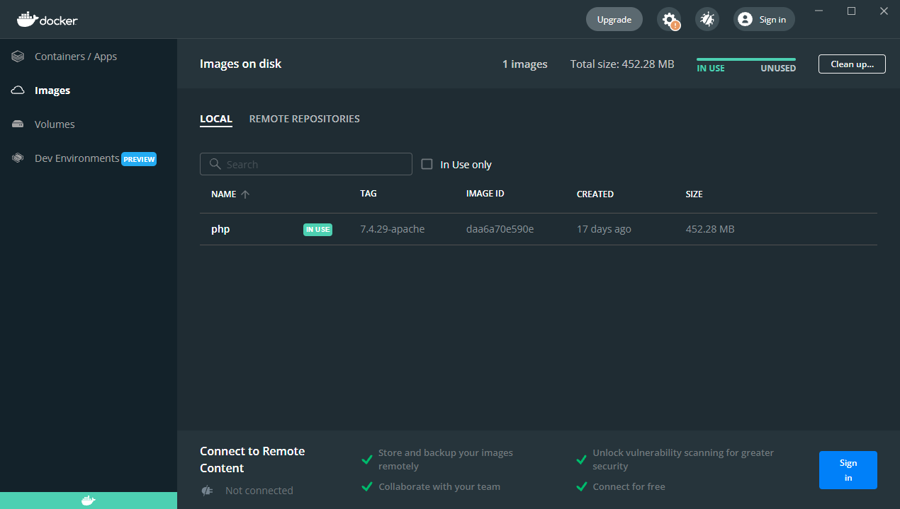
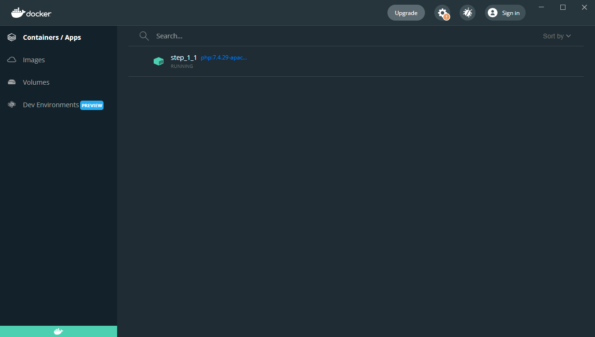
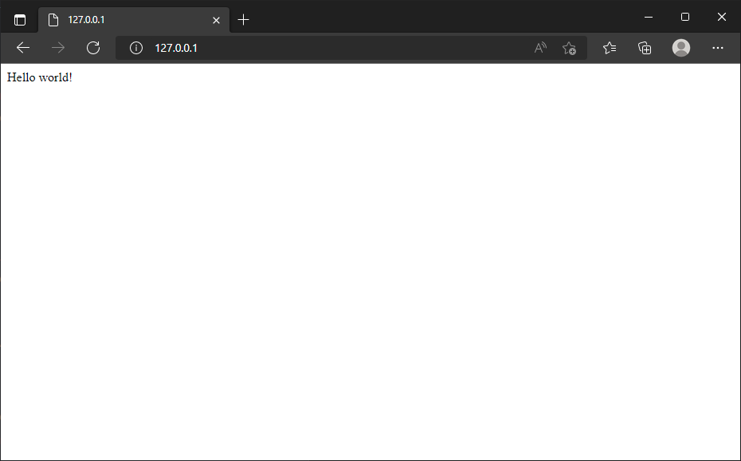

# Exécution d'un script php

> Les commandes que nous utiliserons lors cette étape seront les mêmes que vous soyez sous Linux, Mac ou Windows.

En exécutant l'instruction ci-dessous nous allons télécharger PHP 7.4.29 ainsi qu'Apache (l'image Docker contient les deux logiciels) et démarrer l'image:

```bash
docker run --detach --name step_1_1 -p 80:80 php:7.4.29-apache
```

*Lors des exécutions ultérieures, l'image PHP étant déjà présente, elle n'est plus téléchargée.*

----

Nous pouvons constater que l'image PHP est maintenant présente dans Docker Desktop.



En ligne de commande : `docker image list`

----

Nous voyons aussi qu'une application (un `container` en terme Docker) est également en cours d'exécution.



En ligne de commande : `docker container list`

----

Explication des arguments utilisés dans notre commande `docker run --detach --name step_1_1 -p 80:80 php:7.4.29-apache`

* `--detach` : par défaut, `docker run` exécute le container et le ferme aussitôt le travail terminé. Si l'image était un scanner de virus, `docker run` exécuterait un scan et ferme le container le scan terminé. Ici, nous voulons que notre site reste "à l'écoute",
* `--name step_1_1` : juste par simplicité, donnons un nom à notre container. C'est une pratique recommandée pour identifier clairement les containers,
* `-p 80:80` : notre image PHP+Apache s'exécute sur le port `80`, nous souhaitons "mapper" ce port "interne" au port `80` de notre ordinateur. Ceci nous permet alors d'accéder au site web.

----

Tentons d'accéder au site local : [http://127.0.0.1:80](http://127.0.0.1:80).

Il fonctionne mais n'affiche rien puisque nous n'avons encore rien mis en place.


----

Avec l'instruction ci-dessous, on peut lancer une console Linux et afficher le contenu de l'image "comme si" c'était un dossier sur notre disque dur :

```bash
docker exec -it step_1_1 /bin/bash
```

Une fois dans la console, créons rapidement un fichier `index.php` et quittons la console; nous n'en aurons plus besoin.

```bash
echo "Hello world!" > index.php
exit
```

----

Notre script s'exécute maintenant dans Docker !



----

Reprennons l'instruction que nous avions utilisé : 

```bash
docker run --detach --name step_1_1 -p 80:80 php:7.4.29-apache
```

On voit donc qu'on cible la version `7.4.29` de PHP. En se rendant sur la page
[https://hub.docker.com/_/php?tab=tags](https://hub.docker.com/_/php?tab=tags) et en cherchant des images de type `-apache`, on retrouve p.ex. les versions `php:8.1.1-apache` ou encore `php:8.1.5-apache`.

Et donc, si on exécute l'instruction ci-dessous, on sélectionne donc la version 8.1.5. Rien de plus facile !

```bash
docker run --detach --name step_1_1 -p 80:80 php:8.1.5-apache
```

----

À la fin de ce chapitre, nous venons d'apprendre

* à utiliser Docker,
* à définir la version de PHP que nous souhaitons utiliser.

Passons maintenant à la vitesse supérieure et synchronisons les fichiers de notre disque dur avec le container.
