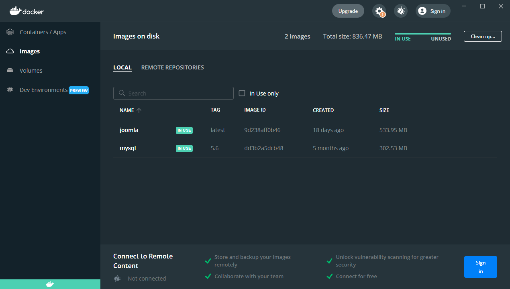
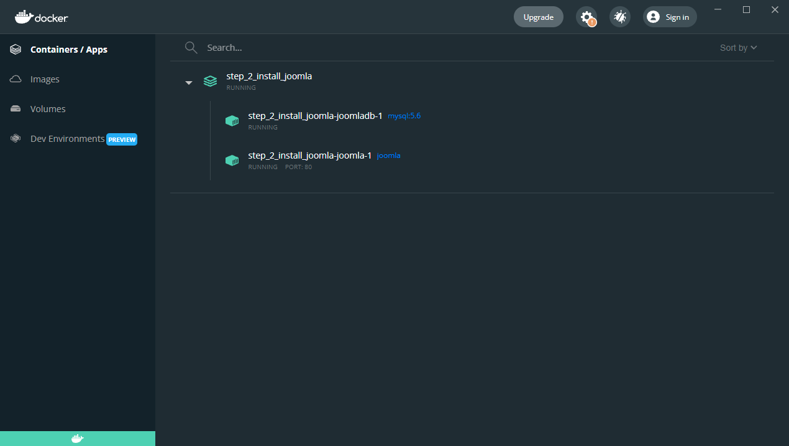
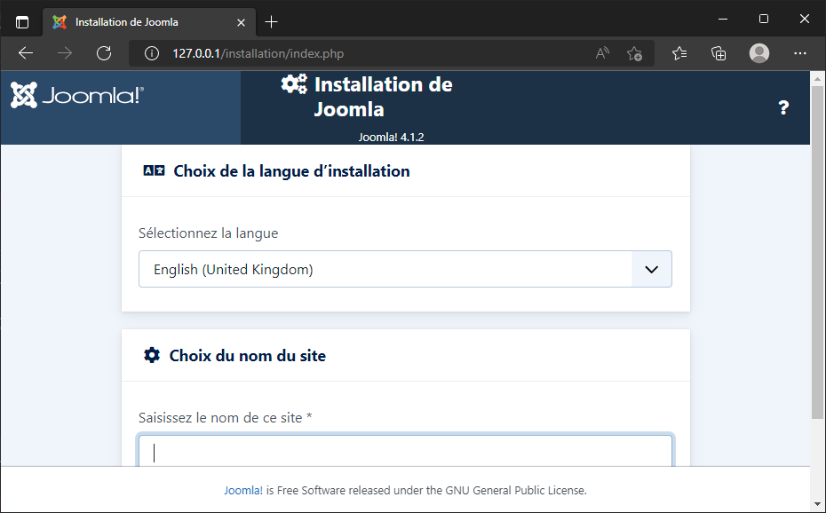
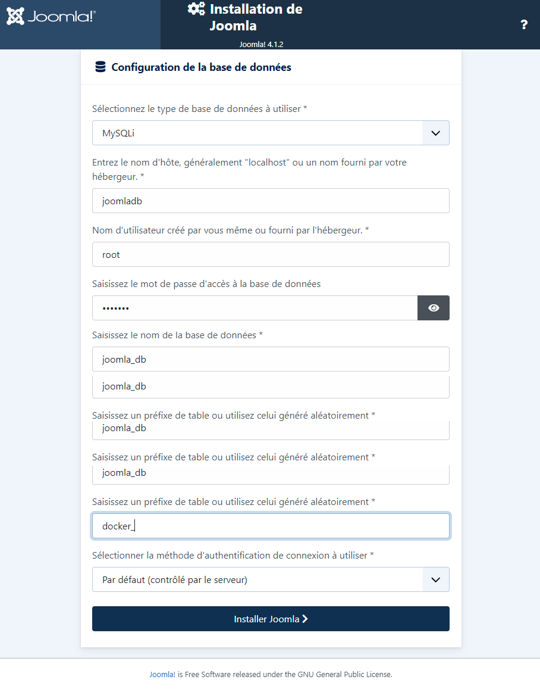
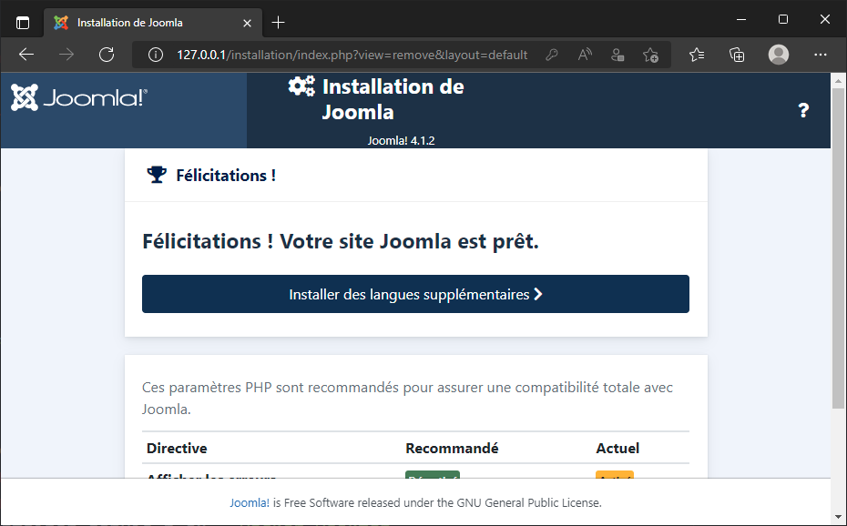

# Étape 2 - Installons Joomla

Lors de la première étape, nous n'avions pas besoin d'une base de données, juste de PHP et d'Apache. Et comme il existe une image Docker qui reprend et PHP et Apache, c'était facile. Un coup de `docker run` et tout roule.

Lorsqu'on a besoin de plusieurs *services*, il faut pouvoir démarrer PHP+Apache et p.ex. MySQL. Ici, `docker run` ne suffit plus.  

----

Lorsqu'on a besoin de plusieurs services, il faut un fichier `docker-compose.yml` à la racine du projet. On y définit la liste des services dont on a besoin.

Vous trouverez un exemple du fichier `docker-compose.yml` sur la page de description de l'image Joomla : [https://hub.docker.com/_/joomla](https://hub.docker.com/_/joomla) *recherchez `docker-compose` sur cette page.*

Notes: 

1. J'ai juste inversé la base de données avec Joomla car il me paraît plus logique de d'abord définir la couche DB puis la couche applicative.
2. J'ai conservé le fichier proposé par Joomla même s'il n'est pas forcément le plus intuitif (pour la partie des noms et des valeurs).

----

```yaml
version: '3.1'

services:
  joomladb:
    image: mysql:5.6
    restart: always
    environment:
      MYSQL_ROOT_PASSWORD: example

  joomla:
    image: joomla
    restart: always
    links:
      - joomladb:mysql
    ports:
      - 80:80
    environment:
      JOOMLA_DB_HOST: joomladb
      JOOMLA_DB_PASSWORD: example
```

----

Créons ce fichier dans un dossier de votre disque dur.

Ceci fait, lancez la commande `docker compose up --detach` depuis une console.

Docker va commencer à télécharger `joomla` et `joomladb`

----

Si on regarde la liste des images disponibles dans Docker Desktop, nous voyons que nous avons maintenant, `joomla` et `mysql`.



On obtient aussi l'information en ligne de commande : `docker image list`

----

On retrouve aussi notre application qui, cette fois, contient deux containers en cours d'exécution.



En ligne de commande : `docker container list`

----

Notre application étant en cours d'exécution, on peut y accéder depuis l'URL http://127.0.0.1:80 et qu'on a l'interface d'administration.



----

Reprennons le fichier `docker-compose.yml` mais partie par partie: 

```yaml
services:
  joomladb:
    image: mysql:5.6
    restart: always
    environment:
      MYSQL_ROOT_PASSWORD: example
```

On va définir une couche base de données qui va faire tourner MySQL en version `5.6`. Le mot de passe associé au compte `root` sera `example`.

----

```yaml
services:
  joomla:
    image: joomla
    restart: always
    links:
      - joomladb:mysql
    ports:
      - 80:80
    environment:
      JOOMLA_DB_HOST: joomladb
      JOOMLA_DB_PASSWORD: example
```

On définit ici la couche application (Joomla) sans préciser de version. Ce sera donc la dernière version `stable` de ce moment-là. On dit à Joomla que le serveur de base de données associé sera `joomladb` qu'on a définit plus haut, on indique que le port sera le port `80` et on définit aussi deux variable d'environnements pour préciser que le nom de la base de données sera `joomladb` et que le mot de passe associé est `example`.

----

Remarque: ce n'est pas une bonne idée de ne pas indiquer le numéro de version.

Lorsque Docker voit `image: joomla`, il comprend `image: joomla:stable`. Il va donc chercher à télécharger la dernière version stable. Vous ne savez donc pas, à l'avance, si vous télécharger Joomla `4.1.2` ou `4.1.3` ou ... 

Il est toujours préférable de spécifier la version comme p.ex.  `image: joomla:4.1.2`. Vous vous éviterez des surprises.

Voir [https://hub.docker.com/_/joomla?tab=tags](https://hub.docker.com/_/joomla?tab=tags) pour la liste des versions disponibles.

----

Les valeurs se retrouvent dans le fichier `docker-compose.yml`.

| Variable | Valeur |
| --- | --- |
| Nom de l'hôte | `joomladb` qui est le nom qu'on a donné au service base de données |
| Nom de l'utilisateur | `root` (utilisateur par défaut pour MySQL) |
| Mot de passe | `example` |

----



----



----

Nous venons d'installer Joomla et MySQL. Si on exécute `ls -l` (ou `dir` sous DOS), on constate quelque chose qui pourrait être surprenant : nous n'avons aucun des fichiers de Joomla sur notre machine; rien du tout.

Comme nous l'avons vu lors de l'étape 1 d'introduction; tout se passe au sein du container. Comme si c'était une boîte noire. Les fichiers ont été installés dans le container, pas sur notre ordinateur.

**Si on supprime le container Docker, nous perdons l'intégralité du site; base de données y compris.**

## Session interactive

Si on lance `Docker Desktop` et qu'on se rends dans la liste des containers puis qu'on déplie le container en cours, on peut voir que le nom du service Apache est `step_2_install_joomla-joomla-1` (c'est-à-dire le nom du dossier en cours suivi du nom du service suivi du chiffre `1`).

On retrouve aussi le nom avec la ligne de commande `docker container list`.

Du coup `docker exec -it step_2_install_joomla-joomla-1 /bin/bash` permet de lancer une console dans le container et de se promener dans l'arborescence du l'installation Joomla.

Si on fait un `cat configuration.php`, on peut donc voir le fichier de configuration du site. Puisqu'il n'y a pas d'éditeur de texte dans l'image Joomla, utilisons `sed` pour remplacer la valeur offline de `false` vers `true` :

```bash
sed -i 's/public $offline = false/public $offline = true/g' configuration.php
```

Si on rafraîchit le navigateur, on voit bien qu'on a mis le site hors ligne. Ce qu'on voit dans la session interactive correspond bien à ce qu'on a sur la page du navigateur; nous sommes bien occupés à modifier le site Joomla.

----

À la fin de ce chapitre, nous avons appris :

* à créer un fichier `docker-compose.yml` afin de créer et associer plusieurs containers pour une application précise,
* à installer la version que nous souhaitons de Joomla,
* à installer un second service qui, ici, est MySQL,
* à associer Joomla et MySQL,
* à adapter un fichier de Joomla en démarrant le container de façon interactive.

Lors du prochain chapitre, nous verrons comment synchroniser les fichiers entre le container et notre disque dur.
