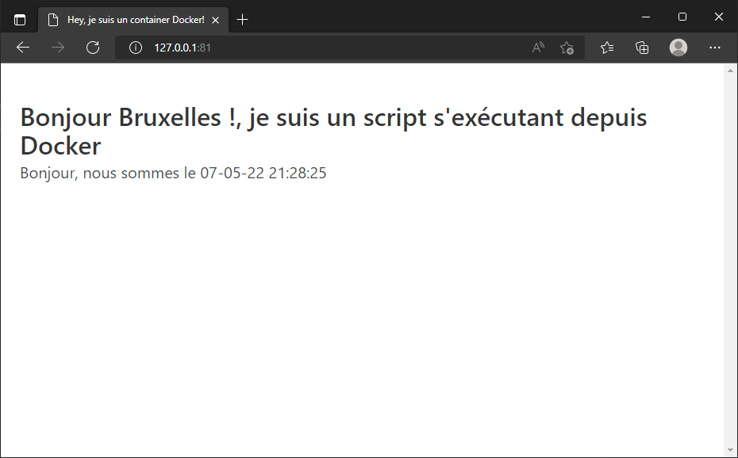

# Étape 1.2 - Utilisation d'un volume

> Soyez certain d'être dans le sous-dossier step_1_php/2_volume pour exécuter les exemples fournis.

Afin de synchroniser un fichier de notre disque dur avec le container, utilisons un volume:

```bash
docker run --detach --name step_1_2 -p 81:80 -v $(pwd):/var/www/html php:8.1.5-apache
```

Si vous êtes sous Windows (MS DOS), remplacez `$(pwd)` par `%CD%` dans l'instruction ci-dessus.

----

Exécutons notre script : [http://127.0.0.1:81](http://127.0.0.1:81).

Super ! Notre script s'exécute sans qu'on ait à "chipoter".



----

Explication des nouveaux arguments utilisés dans notre commande `docker run --detach --name step_1_2 -p 81:80 -v $(pwd):/var/www/html php:8.1.5-apache`

* `--name step_1_2` : par clarté, nous utilisons un autre nom,
* `-p 81:80` : cette fois, nous allons utiliser le port `81` de notre ordinateur et nous allons le mapper au port `80` du container,
* `-v $(pwd):/var/www/html` : l'instruction `-v` permet de définir un volume. Ici, nous allons synchroniser le dossier `/var/www/html` du container avec `$(pwd)` qui correspond au dossier courant de notre ordinateur.

----

Éditons le fichier `index.php` et changeons p.ex. `Bruxelles` en `la Belgique`.

Retournons dans notre navigateur et appuyons sur la touche <kbd>F5</kbd>. Le changement est immédiat.


----

<!-- .slide: data-background="./images/we-have-learned.jpg" data-background-size="cover" -->

À la fin de ce chapitre, nous avons appris, en plus:

* à synchroniser un dossier (et ses sous-dossiers) de notre ordinateur avec le container.

Dans la troisième étape de ce chapitre, nous allons garantir que les fichiers qui seraient créés depuis Docker le soient avec les bonnes permissions (`user:group` et `chmod`).
