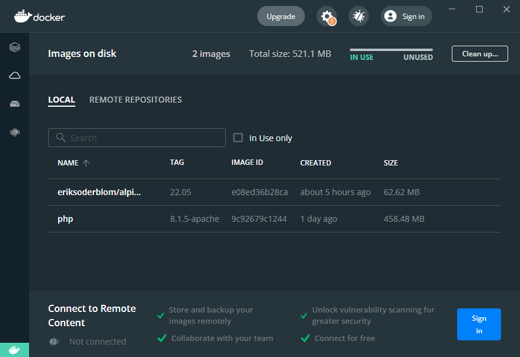

# Étape 1.4 - Recherche d'une image de type Alpine

> Sous Linux, une image Alphine est synonyme d'ultra-légère. Le maximum a été retiré et juste l'essentiel est conservé.

Nous avons jusqu'à présent utilisé une image officielle maintenue par la communauté Docker [https://hub.docker.com/_/php](https://hub.docker.com/_/php). Ces images sont sécurisées car validées par la communauté.

```bash
docker run --detach --name step_1_2 -p 81:80 -v $(pwd):/var/www/html php:8.1.5-apache
```

----

Il n'existe pas toujours une image alpine officielle (ce n'est pas le cas pour une image PHP incluant Apache).

Si on cherche sur [Docker Hub](https://hub.docker.com/), il est toutefois possible d'en trouver comme [eriksoderblom/alpine-apache-php](https://hub.docker.com/r/eriksoderblom/alpine-apache-php) qui propose PHP 8 + Apache en mode hyper léger. 

----

Là où l'image officielle fait 458MB, l'image alpine n'est fait plus de 62. Près de 7,5 fois moins !



----

L'intérêt de ce type d'images est donc de réduire l'occupation mémoire de votre ordinateur et de vous permettre de lancer plusieurs images sans trop de ralentissement. 

Cela ne fonctionne que si et seulement si vos besoins sont hyper simples. Vous souhaitez p.ex. installer quelque chose avec `apt-get install` ? Impossible car le gestionnaire de paquets `apt` n'est pas installé. Vous avez vraiment le strict minimum et vous aurez à tout installer vous-même selon vos besoins.

----

<!-- .slide: data-background="./images/we-have-learned.jpg" data-background-size="cover" -->

Un petit extra pour la route, utilisation d'un script Bash. Rendez-vous à la prochaine, et dernière, étape.
