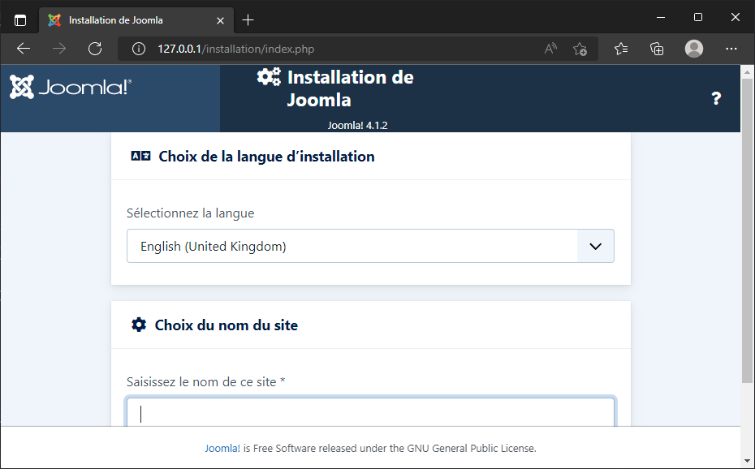

# Étape 2.1 - Installons Joomla

> Soyez certain d'être dans le sous-dossier step_2_install_joomla/1_installation pour exécuter les exemples fournis.

Lors de la première étape, nous n'avions pas besoin d'une base de données, juste de PHP et d'Apache. Et comme il existe une image Docker qui reprend et PHP et Apache, c'était facile. Un coup de `docker run` et tout roule.

Lorsqu'on a besoin de plusieurs *services*, une commande `docker run` ne suffit plus. Il faut alors utiliser `docker compose`.

----

Lorsqu'on a besoin de plusieurs services, il faut un fichier `docker-compose.yml` à la racine du projet. On y définit la liste des services dont on a besoin.

Vous trouverez un exemple du fichier `docker-compose.yml` sur la page de description de l'image Joomla : [https://hub.docker.com/_/joomla](https://hub.docker.com/_/joomla) *recherchez `docker-compose` sur cette page.*

----

```yaml
version: '3.1'

services:
  joomladb:
    image: mysql:5.6
    restart: always
    environment:
      MYSQL_ROOT_PASSWORD: example

  joomla:
    image: joomla
    restart: always
    links:
      - joomladb:mysql
    ports:
      - 80:80
    environment:
      JOOMLA_DB_HOST: joomladb
      JOOMLA_DB_PASSWORD: example
```

----

Créons ce fichier dans un dossier de votre disque dur.

Ouvrez une console et rendez-vous dans ce dossier.

Ceci fait, lancez la commande `docker compose up --detach`.

Docker va commencer à télécharger `joomla` et `joomladb`, les deux services mentionnés dans le fichier `docker-compose.yml`.

----

<!-- .slide: data-background="./images/desktop_image_step_2.png" data-background-size="cover" class="hide_title" -->

----

Si on regarde la liste des images disponibles dans Docker Desktop, nous voyons que nous avons maintenant, `joomla` et `mysql`.

On obtient aussi l'information en ligne de commande : `docker image list`

----

<!-- .slide: data-background="./images/desktop_container_step_2.png" data-background-size="cover" class="hide_title" -->

----

On retrouve aussi notre application qui, cette fois, contient deux containers en cours d'exécution.

En ligne de commande : `docker container list`

----

Notre application étant en cours d'exécution, on peut y accéder depuis l'URL http://127.0.0.1:80.



----

Reprenons le fichier `docker-compose.yml` mais partie par partie:

```yaml
services:
  joomladb:
    image: mysql:5.6
    restart: always
    environment:
      MYSQL_ROOT_PASSWORD: example
```

On va définir une couche base de données qui va faire tourner MySQL en version `5.6`. Le mot de passe associé au compte `root` sera `example`.

----

```yaml
services:
  joomla:
    image: joomla
    restart: always
    links:
      - joomladb:mysql
    ports:
      - 80:80
    environment:
      JOOMLA_DB_HOST: joomladb
      JOOMLA_DB_PASSWORD: example
```

On définit ici la couche application (Joomla) sans préciser de version. Ce sera donc la dernière version `stable` de ce moment-là. On dit à Joomla que le serveur de base de données associé sera `joomladb` qu'on a définit plus haut, on indique que le port sera le port `80` et on définit aussi deux variables d'environnement pour préciser que le nom de la base de données sera `joomladb` et que le mot de passe associé est `example`.

----

<!-- .slide: data-background="./images/danger.jpg" data-background-size="cover" -->

Ce n'est pas une bonne idée de ne pas indiquer le numéro de version.

Lorsque Docker voit `image: joomla`, il comprend `image: joomla:stable`. Il va donc chercher à télécharger la dernière version stable. Vous ne savez donc pas, à l'avance, si vous téléchargez Joomla `4.1.2` ou `4.1.3` ou ...

Il est toujours préférable de spécifier la version comme p. ex.  `image: joomla:4.1.2`. Vous vous éviterez des surprises.

Voir [https://hub.docker.com/_/joomla?tab=tags](https://hub.docker.com/_/joomla?tab=tags) pour la liste des versions disponibles.

----

Les valeurs se retrouvent dans le fichier `docker-compose.yml`.

| Variable             | Valeur                                                             |
| -------------------- | ------------------------------------------------------------------ |
| Nom de l'hôte        | `joomladb` qui est le nom qu'on a donné au service base de données |
| Nom de l'utilisateur | `root` (utilisateur par défaut pour MySQL)                         |
| Mot de passe         | `example`                                                          |

----


----


----

<!-- .slide: data-background="./images/surprised.jpg" data-background-size="cover" -->

Nous venons d'installer Joomla et MySQL. Si on exécute `ls -l` (ou `dir` sous DOS), on constate quelque chose qui pourrait être surprenant : nous n'avons aucun des fichiers de Joomla sur notre machine; rien du tout.

Comme nous l'avons vu lors de l'étape 1 d'introduction; tout se passe au sein du container. Comme si c'était une boîte noire. Les fichiers ont été installés dans le container, pas sur notre ordinateur.

Si on supprime le container Docker, nous perdons l'intégralité du site; base de données y comprise.

----

Envie d'utiliser une autre version de PHP ? Rendez-vous sur la page des tags [https://hub.docker.com/_/joomla?tab=tags](https://hub.docker.com/_/joomla?tab=tags) et prêtez attention aux images de type `xxx-apache` (p. ex. `php8.1-apache`).

Adaptez alors le fichier `docker-compose.yml` comme ci-dessous.

```yaml
services:
  joomla:
    image: joomla:php8.1-apache
```

Et hop, vous voilà avec la version de PHP désirée.

----

<!-- .slide: data-background="./images/we-have-learned.jpg" data-background-size="cover" -->

À la fin de cette étape, 

* à créer un fichier `docker-compose.yml` afin de créer et associer plusieurs containers pour une application précise,
* à installer la version que nous souhaitons de Joomla ainsi que celle de PHP,
* à installer un second service qui, ici, est MySQL,
* et à associer Joomla et MySQL

Toutefois notre site est éphémère. Apprenons à conserver nos fichiers et notre base de données. Mais avant, lançons une petite session interactive dans Docker.
