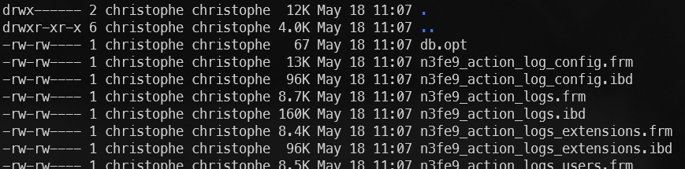

# Étape 4 - Synchronisons MySQL avec notre ordinateur local

<!-- .slide: data-background="./images/background.jpg" data-background-size="cover" -->

----

> Soyez certain d'être dans le sous-dossier step_4_install_mysql_volume pour exécuter les exemples fournis.

Nous venons de voir comment conserver les fichiers de Joomla sur son disque dur. Ainsi, si on supprime le container Docker, on ne perd pas nos fichiers.

<mark>Oui mais ? Et la base de données ?</mark>

Sous MySQL, une base de données est sauvée dans le dossier `/var/lib/mysql` (plus d'info sur [Where to Store Data](https://hub.docker.com/_/mysql))

----

Comme nous l'avions fait pour Joomla lorsqu'on a créé un dossier `site_joomla`, il nous faudra créer un dossier `db` manuellement afin qu'on n'ait pas de souci de droits d'accès.

Ceci fait, il faut adapter le fichier `docker-compose.yml` et, pour le service MySQL cette fois, d'ajouter la gestion des *volumes*. Ajoutons directement le bon utilisateur:

**D'abord, pour éviter tout problème de droits d'accès, veuillez créer le dossier `db` vous-même.**

*Recréons aussi le dossier `site_joomla` (puisque, dans cet exemple, nous sommes dans un autre dossier que le précédent chapitre).*

```bash
mkdir -p db
mkdir -p site_joomla
```

----

Adaptons le fichier `docker-compose.yml` et ajoutons au niveau du server `joomladb` les lignes suivantes: 

```yaml
    user: "1000:1000"
    volumes:
      - ./db:/var/lib/mysql
```

----

Retournons dans Docker Desktop et supprimons notre container Joomla en cours d'exécution.

Lançons la commande `docker compose up --detach`.

Notez qu'il y a un petit délai nécessaire pour que Docker synchronise le container avec votre disque dur. Vous ne verrez pas les fichiers apparaître sur votre disque avant un délai de quelques secondes.

----

Maintenant, si nous allons dans le dossier `./db`, nous pouvons en effet voir un dossier qui correspond à notre base de données. Notre base de données se nommait `joomla_db`, nous avons bien un dossier local `/db/joomla_db`.

`n3fe9_` étant ici le préfixe pour nos tables Joomla.



----

Ajoutons les données d'exemples et p. ex. un nouvel utilisateur puis, depuis Docker Desktop, supprimons une fois encore le container comme nous l'avons fait pour les autres exercices.

Puisque, au terme de ce chapitre, nous avons synchronisé et les fichiers et la base de données; au lieu de tout perdre, nous nous attendons tout récupérer. Voyons ce qu'il en est. 

Relançons la commande `docker compose up --detach` et voyons ce qu'il se passe...

----

<!-- .slide: data-background="./images/joomla_site_is_back.png" data-background-size="cover" -->

Nous récupérons notre site web, base de données comprises ! Notre site est de nouveau fonctionnel, les extensions que nous avions installées sont toujours présentes, nos articles, nos utilisateurs ... tout est à nouveau là.

Nos deux volumes externes (`db` et `site_joomla`) ont parfaitement rempli leur mission.

----

<!-- .slide: data-background="./images/we-have-learned.jpg" data-background-size="cover" -->

À la fin de ce dernier chapitre, nous avons appris :

* à manipuler Docker et créer des sites web PHP / Apache,
* à installer Joomla et de créer un site web *dockerisé* (=qui tourne sous forme de container dans Docker),
* à synchroniser les fichiers et la base de données de notre site.
